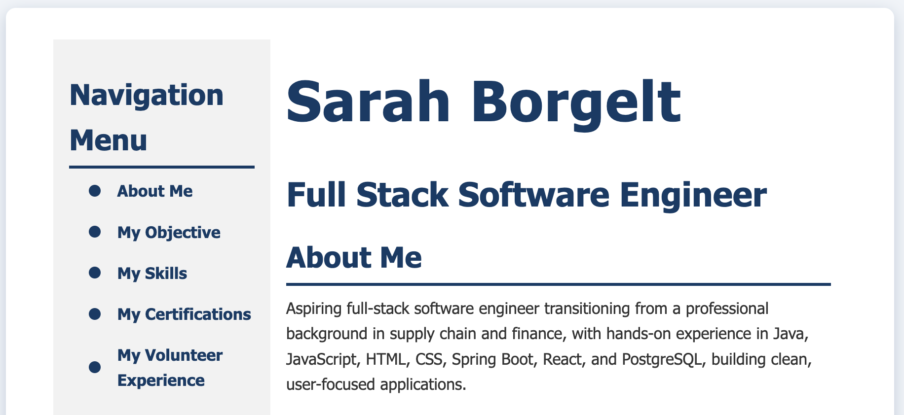

# Sarah Borgelt – Aspiring Software Engineer
Transitioning from supply chain operations to software development with a strong foundation in full-stack technologies.

## 💼 About Me

I am a passionate and motivated aspiring software engineer, transitioning from a professional background in supply chain to technology. My journey into coding began after a pivotal life moment in January 2025, when I lost my mother unexpectedly. This experience inspired me to pursue meaningful changes in my life, including exploring new career opportunities that aligned with my curiosity and problem-solving mindset.

Almost by chance, I enrolled in an introductory programming class through We Can Code IT, where I learned the fundamentals of HTML, CSS, and JavaScript. I immediately discovered a love for creating functional and visually appealing web applications.

Building on that foundation, I completed the Responsive Web Design Certification through freeCodeCamp in June 2025, deepening my skills in modern web development and responsive design. Seeking a more comprehensive understanding of software engineering, I then enrolled in Tech Elevator, where I am currently mastering full-stack development with Java, Spring Boot, PostgreSQL, JavaScript, HTML, and CSS.

I am dedicated to building clean, user-friendly applications and continuously improving my skills through personal projects and hands-on practice. I am eager to contribute my technical abilities, creativity, and strong work ethic to a tech internship or entry-level role, where I can grow as a developer while making a meaningful impact.

## 📄 View My Resume

Access the live version of my resume here:  
👉 [https://sarahborgelt.github.io/Resume/](https://sarahborgelt.github.io/Resume/)

## 🔗 Quick Links

- **LinkedIn:** [linkedin.com/in/sarahnicole1](https://www.linkedin.com/in/sarahborgelt)  
- **GitHub:** [github.com/SarahBorgelt](https://github.com/SarahBorgelt)

## 💻 Technical Skills
- **Languages:** Java, JavaScript, HTML, CSS  
- **Frameworks/Tools:** Spring Boot, React, JDBC  
- **Databases:** PostgreSQL, SQL  
- **Other:** Responsive Web Design, Agile, Unit Testing, E/R Diagrams, Table Design  

## 🏆 Highlights
- Completed **Responsive Web Design Certification** – freeCodeCamp (June 2025)  
- Currently mastering **full-stack development** at Tech Elevator  
- Developed **hands-on projects** demonstrating clean code, responsive UI, and practical software engineering principles  

## 🎯 Career Goals
- Seeking **internships or entry-level software engineering roles**  
- Committed to building **clean, user-friendly applications** and continuously improving technical skills

## 📬 Contact

Feel free to reach out via email: borgelt.sarah@gmail.com
